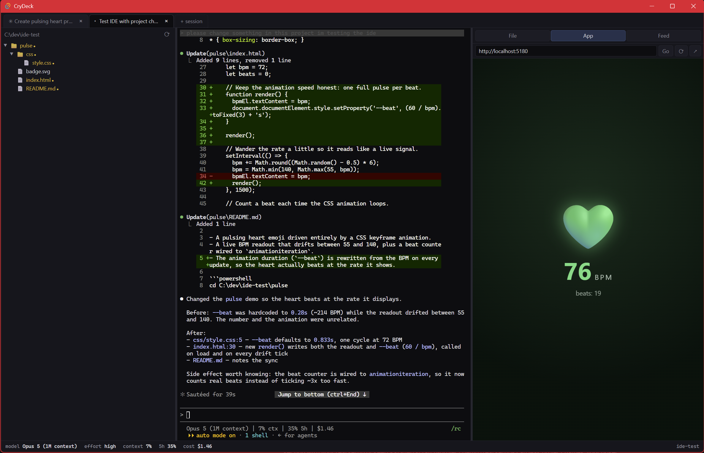

# CryDeck

A lightweight Windows desktop shell for [Claude Code](https://claude.com/claude-code).
Tabs of Claude sessions, a live file tree, and a preview pane where you can
actually use what Claude builds.

Not an IDE. No editor, no LSP, no debugger, no extension host. Claude does the
writing; CryDeck is where you watch, steer, and try the result. That omission
is the entire reason it stays light (~250MB working set, single small binary).



```
┌─ tabs: one Claude Code session per tab, each its own folder ────────┐
├──────────────┬──────────────────────────────┬──────────────────────┤
│ file tree    │ terminal (Claude Code TUI)   │ preview              │
│ live, unread │ real PTY via ConPTY          │ File | App | Feed    │
│ marks        │ pwsh 7 + predictions         │ live localhost apps  │
├──────────────┴──────────────────────────────┴──────────────────────┤
│ status: model | effort | context % | 5h/weekly limits | cost       │
└─────────────────────────────────────────────────────────────────────┘
```

## Getting started (never used a terminal before? start here)

1. **Download** `CryDeck_x64-setup.exe` from the
   [latest release](https://github.com/saitaskar/crydeck/releases/latest) and
   run it. Windows SmartScreen may warn about an unknown publisher — choose
   "More info" → "Run anyway".
2. **First launch.** CryDeck checks your machine. If Git or Claude Code are
   missing it offers to install them — click **Install** and watch it happen
   in a terminal tab (approve the Windows permission popup if one appears).
   The tab flows straight into Claude Code's **login**: you need a Claude
   account with a Pro or Max plan (https://claude.ai). Already have
   everything installed? You'll never see any of this.
3. **Make a projects folder.** Anywhere you like, e.g. `C:\Projects`, with one
   subfolder per project (`C:\Projects\my-first-app`). A CryDeck tab = Claude
   working inside one such folder.
4. **Open a session.** Click **Open a folder**, pick your project folder, and
   type what you want in plain words ("build me a page that tracks my
   expenses"). Claude writes the files; the tree on the left shows what it
   touched; the preview pane on the right runs the result.
5. **Updates are automatic.** CryDeck checks for new versions on launch and
   asks before installing.

## What it does

- **Tabs are sessions.** One working directory + one Claude Code process per
  tab (cap 6), restored on relaunch **with their conversations** (via
  `--continue`). Sessions launch with Remote Control on, so your phone can
  pick any of them up. Background tabs show a blue pulse while their Claude
  works and an amber dot when it finishes or needs you.
- **The tree is live and knows what Claude touched.** Files Claude edits glow
  amber; open one and it turns green (seen); a re-edit flips it back; blue
  dots mark uncommitted git changes. Powered by Claude Code's own hook
  events, not filesystem guessing. The watcher tracks only the root +
  expanded folders, so a tab on a huge parent dir is cheap, and a project
  folder Claude scaffolds appears the moment it lands.
- **Preview pane, three modes.** *File*: read-only viewer (code, rendered
  markdown, images) with a **Content|Diff switch**; files Claude just changed
  default to the diff. *App*: a real embedded webview with page tabs; the
  first dev server the session starts loads automatically and stays alive
  across tab switches. *Feed*: everything Claude produced, newest first. *Review*: a supervision queue grouping edits under the prompt that caused them, with unreviewed counts and per-task sign-off.
- **Point at things, literally.** Element select (🎯): click any element in
  the running app and its selector, text and position are typed into Claude's
  prompt. Annotations (✏️): draw numbered boxes on the page, hit Send, and
  Claude gets the coordinates plus a screenshot with your boxes on it.
- **Extra terminals** (⌨): up to three plain pwsh terminals per session in a
  strip under the preview.
- **Auto-continue after rate limits.** Right-click a tab and schedule a
  `continue` for one minute after the limit resets (CryDeck knows the reset
  time from the statusLine hook) or any custom delay. Always set by you,
  never automatic; countdown in the status bar.
- **OS integration.** Double-click opens files in their default app (docx to
  Word, xlsx to Excel) and folders in Explorer. Right-click a folder to spin
  it up as a new session.
- **Status bar** from Claude Code's statusLine hook: model, effort, context %,
  5h/weekly rate limits, session cost. The Claude TUI status line inside the
  terminal shows a compact version of the same.

## How the hook wiring works (please read before installing)

On first launch CryDeck merges three entries into `~/.claude/settings.json`:
a `statusLine` command, a `PostToolUse` hook, and a `UserPromptSubmit` hook
(the review queue's task boundaries). Each is a single direct
`curl.exe` call to a loopback-only gateway (fixed port range 48620-48639,
per-install token). Your original settings file is backed up once as
`settings.json.pre-cockpit`; an existing statusLine you wrote yourself is
never replaced; entries are never duplicated. Outside CryDeck the hooks fail
in milliseconds (connection refused) and Claude carries on unaffected.

Why not `--settings`? Claude Code on Windows executes hook commands through
git-bash and does not trust hooks from flag-supplied settings files. The
shell-agnostic single-line curl form is the only shape that survives cmd,
bash and PowerShell alike. The scars are documented in PLAN.md.

## Requirements

- Windows 11 (WebView2, ConPTY)
- A [Claude](https://claude.ai) account (Pro or Max plan) for the login
- [Claude Code](https://claude.com/claude-code) and Git — **installed for you
  on first launch if missing** (official installer / winget, run visibly in a
  terminal tab)
- PowerShell 7 (`pwsh`) recommended for inline prediction ghost text;
  falls back to Windows PowerShell

## Build from source (developers)

Users should just grab the [installer](https://github.com/saitaskar/crydeck/releases/latest);
this is for hacking on CryDeck itself. Needs Rust (MSVC toolchain) + pnpm.

```powershell
pnpm install
pnpm tauri build --no-bundle
# binary lands in src-tauri/target/release/
```

Run it bare, or pass a folder to open a session there:

```powershell
crydeck.exe C:\dev\myproject
```

Dev mode: `pnpm tauri dev`. Always build releases through the Tauri CLI — a
raw `cargo build` produces a binary that points at a dev server that is not
running (PLAN.md, Phase 0 defect 4).

## Known limitations

- Windows-only by design (ConPTY, cmd/Explorer integration).
- Closing a tab kills its whole process tree via a kill-on-close Job Object —
  that's the leak protection. The conversation itself survives: the tab
  resumes it (`--continue`) on next launch.
- A session's shell is pwsh (or Windows PowerShell); Claude launches
  automatically in each new tab.

## License

MIT
